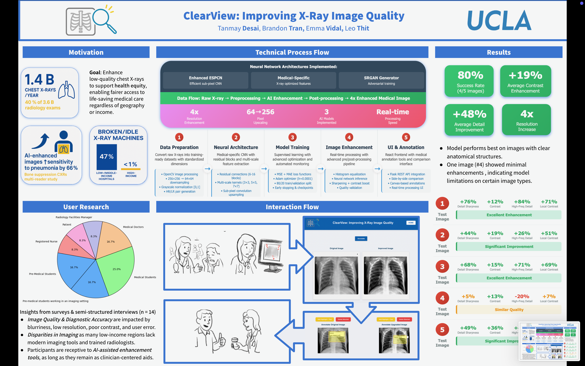

# ClearView: AI-Powered X-Ray Image Enhancement

> Improving diagnostic quality of chest X-rays using deep learning super-resolution — built to support health equity in underserved communities.

**UCLA CS Project** 

---

## Motivation

**1.4 billion** chest X-rays are taken globally each year. In low- and middle-income hospitals, fewer than 1% have access to high-quality imaging equipment, compared to 47% of broken or idle machines in these regions. Poor image quality directly impacts diagnostic accuracy, AI-enhanced images have been shown to increase pneumonia detection sensitivity by up to 66%.

ClearView is an open-source pipeline that takes a low-quality chest X-ray and outputs a 4x super-resolution enhanced version in real time, with no specialized hardware required.

---



---

## Results

Evaluated across 5 test images from the NIH Chest X-ray dataset:

| Test Image | Detail Sharpness | Contrast | High-Freq Detail | Local Contrast | Rating |
|---|---|---|---|---|---|
| Image 1 | +76% | +12% | +84% | +71% | ✅ Excellent |
| Image 2 | +44% | +19% | +26% | +51% | ✅ Significant |
| Image 3 | +68% | +15% | +71% | +69% | ✅ Excellent |
| Image 4 | +5% | +13% | -20% | +7% | ⚠️ Similar |
| Image 5 | +49% | +36% | +49% | +45% | ✅ Significant |

**Overall: 80% success rate (4/5 images), +19% average contrast enhancement, +48% average detail improvement**

The model performs best on images with clear anatomical structures. Image #4 showed minimal enhancement, indicating model limitations on certain image types: an area for future work.

---

## Technical Architecture

### Three Neural Network Models Implemented

**1. Enhanced ESPCN (Efficient Sub-Pixel CNN)**
- 6 residual blocks with skip connections
- Sub-pixel convolution (pixel shuffling) for upscaling
- Efficient architecture optimized for real-time inference

**2. Medical-Specific CNN**
- Multi-scale feature extraction with parallel branches (3×3, 5×5, 7×7 kernels)
- 8 dense residual blocks tuned for radiological image characteristics
- Designed to preserve fine anatomical detail

**3. SRGAN-Style Generator**
- 16 residual blocks with batch normalization
- PReLU activations throughout
- Adversarial training objective for perceptually sharper outputs

### Pipeline

```
Raw X-Ray → Preprocessing → AI Enhancement → Post-processing → 4x Enhanced Image
  (input)   (64×64 norm)   (model predict)  (sharpen + CLAHE)   (256×256 output)
```

**Preprocessing:** OpenCV grayscale loading → histogram equalization → Gaussian denoising → normalization to [0,1] → HR/LR pair generation (256×256 and 64×64)

**Training:** MSE + MAE loss, Adam optimizer (lr=0.0001), 80/20 train/val split, early stopping + ReduceLROnPlateau callbacks, ModelCheckpoint saving best weights

**Post-processing:** Neural network inference → sharpening filter (unsharp mask) → contrast boost via histogram equalization → side-by-side comparison output

### Stack

| Layer | Technology |
|---|---|
| Model | TensorFlow / Keras |
| Backend | Python, Flask REST API |
| Frontend | React |
| Image Processing | OpenCV, NumPy |
| Dataset | NIH Chest X-ray (Normal subset) |

---

## User Research

Conducted surveys and semi-structured interviews with **n=14 participants** across radiology facility managers, medical doctors, registered nurses, pre-medical students, and patients.

Key findings:
- Image quality and diagnostic accuracy are most impacted by blurriness, low resolution, poor contrast, and user error
- Imaging disparities are most severe in low-income regions lacking modern equipment and trained radiologists
- Participants are receptive to AI-assisted enhancement tools **as long as they remain clinician-centered aids**

---

## Setup

### Prerequisites
- Python 3.8+
- Node.js and npm
- Git

### Installation

**1. Clone the repository**
```bash
git clone https://github.com/TanmayJDesai/MedicalImageImprovement.git
cd MedicalImageImprovement
```

**2. Backend (Python/Flask)**
```bash
cd backend
python3 -m venv venv
source venv/bin/activate          # Mac/Linux
# venv\Scripts\activate           # Windows
pip install -r requirements.txt
```

**3. Frontend (React)**
```bash
cd ../frontend
npm install
```

### Running the App

Start the backend (runs on port 5002):
```bash
cd backend
source venv/bin/activate
python3 app.py
```

Start the frontend in a new terminal (runs on port 3000):
```bash
cd frontend
npm start
```

Open `http://localhost:3000` in your browser.

### Training Your Own Model

First preprocess the NIH dataset images:
```bash
python preprocess_images.py
```

Then train:
```bash
python train_enhanced_model.py
```

Trained models are saved to `models/` with training history plots.

---

## Limitations & Future Work

- Model #4 showed degraded high-frequency detail on certain image types — exploring perceptual loss functions (VGG-based) as a next step
- Current evaluation is qualitative; future work should include PSNR/SSIM benchmarks against ground truth
- Pipeline could be extended to DICOM format support for clinical integration
- Potential to expand beyond chest X-rays to other modalities (MRI, CT)

---

## References

- Ajmil, A., Smith, J., & Lee, R. (2013). *Chest X-ray Foreign Objects Detection Using Artificial Intelligence*
- de Labouchere, R., Tanaka, T., & Morales, D. (2024). *Utility of bone suppression imaging for the detection of pneumonia on chest radiography*
- Perry, L., & Malkin, R. (2011). *Effectiveness of medical equipment donations to improve health systems: how much medical equipment is broken in the developing world?*

---
